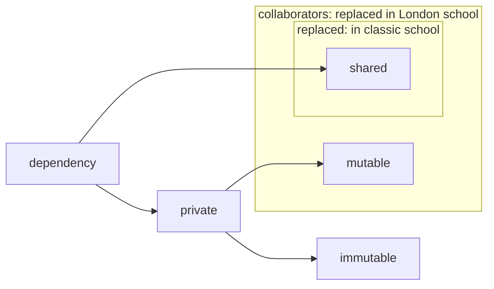
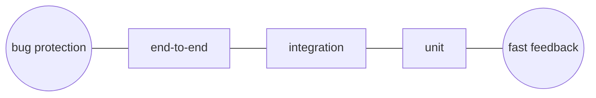

## Intro

This is my summary of the book [**Unit Testing: Principles, Practices and Patterns**](https://www.manning.com/books/unit-testing?query=%20Vladimir%20Khorikov) by [Vladimir Khorikov](https://github.com/vkhorikov) (January 2020, ISBN 9781617296277,  304 pages). 

Here is a witty one-liner I learned for the book:
> code is not an asset, but a liability. That's true for tests too.

First, about the book itself. 
Would I recommend the book? Yes. 
The code examples in the book are written in c# but I think the language in general and the code examples in particular are easy to read for a person who ever learned any OOP language.

Now about my summary.
I tried to leave out any of my own opinion. However, I left out parts that I found either unimportant (I know, I know, that actually IS my opinion) or that are too language specific, e.g. naming conventions.  
The book it separated into 5 parts, so I will do the same with my summaries. This is the first part.
I have not added any code examples. But I definitely want to create a blog post where I apply the principles from the book to the Go programming language in the future. Maybe even to the Rust language, if I ever finally grasp that one.
If you really need code examples to understand any of these concepts or if you find the summary too concise: read the book. I already recommended it. 
Please feel free to send PRs to point out any typos and especially misinterpreted concepts.

# Part one: the bigger picture.
## 1. the goal of unit tests
Code coverage is a good negative indicator: low numbers are bad, but high numbers are not necessarily good. There is no reason to aim for a concrete number of coverage. Aim for test quality instead.

A good tests suite has the following properties:
	- it's integrated into the dev cycle.
	- it only targets the most important parts of the code base.
	- it provides the maximum value with the minimum maintenance costs

Integrated in this case means it is actually executed even after the smallest code changes.

Further, each test should be connected to a business goal.

## 2. what are unit tests?
Unit tests are tests that automatically
	- verifies a small chunk of code; a unit!
	- executes fast
	- tests in isolation

Tests contain the SUT (system under test, for example an instance of a class), one or more *collaborators* (other mutable dependencies but the SUT) and the BUT (method under test) that is the actual subject of the test. 

There are two *schools* of unit testing; the *classic* or *Detroit* school and the *London* (or *mockist*, but this has a negative connotation) school.

The London take is, when testing a class, all collaborators need to be replaced with doubles (as in *a stunt double* in a movie).

The classic school tries to only isolate the dependencies between different tests, for example to not depend on the collaborator like the same instance of an object or the same database.

In general, it is fine to not substitute dependencies with doubles as long as they are immutable. If you have to replace too many collaborators with doubles to write a test and especially if the dependency graph is really complicated, it might be a indicator that your actual code base is poorly structured.

>**Doubles vs Mocks vs Stubs**
>Mocks and doubles are not the same thing. Mocks are a *subset* and a variant of doubles, where the other variant are stubs.

The main issue with the London approach is the high tendency of coupling the tests to the actual implementation details of the tested unit.

Since classic tests use instances of real collaborators instead of doubles, a classic unit test can be considered an integration test in the London school.

Finally, an end-to-end test is an integration test with a wider scope, say more out-of-process dependencies like databases, file systems etc.

## 3. the structure of unit tests
Unit tests usually have the AAA pattern: **arrange, act** and **assert**. First **arrange** a setup, then let the MUT **act** and finally **assert** the result. An alternative name for this is the *given-when-then* pattern. If a test has these sections more than once, it is not a *unit test*, but an *integration test*.

To speed up slow integration tests, it can be okay to have multiple, consecutive *act* and *assert* sections. But don't do so in unit tests. Further, using `if`-statements in tests is an anti-pattern that needs to be avoided. 

The *arrangement* section should always be the largest. The *act* section should be a single line, otherwise it could indicate that the tested API has issues with its encapsulation (which can lead to invariant violation). The *assertion* section can have multiple assertions, but should not grow too large. 

It is possible that there is a fourth section called *teardown* that removes all traces of the tests. It is usually a shared, separate method and is rather uncommon in unit tests.

A good practice is to name the instance of the SUT `sut` because it forces to structure the test around this SUT, distinguishes it from the collaborator and makes the test more readable in general. 

In very concise tests --especially with very brief and simple arrange sections-- the readability can be increased by not using the typical `/Arrange`, `/Act` and `/Assert` comments.

Don't use test-fixtures that hides the arrange-section by using a *Before-Each* kind of methods. Instead, use a factory method to do common arrange logic in the arrange-section of the test. This increases the readability. 

> The book provides some naming guidelines, but I will skip them because they will break with the conventions of certain programming languages, and so I find them of very little value.

Last, use table test for similar test arrangements. The implementation of these is very language specific.

## 4. the four pillars of a good unit tests
1. Bug protection.
	→ this will prevent **false negatives**.
2. Resistance to refactoring; the test still works even if you refactor the tested code.
	→ this will prevent **false positives**. Test for the final result, not for the implementation. Treat the SUT as a black-box; only care for what comes out when a certain something gets put in.
3. fast feedback; build tests that run as fast as possible, so you can run them as often as possible.
4. Maintainability; which can be divided into
	a. readability of the test
	b. how difficult is the test to run (because of out-of process dependencies like databases and such.)

**Bug protection** shows its convenience more at the beginning of a project compared to **resistance to refactoring**, because refactoring is something that might happen more to older projects.  But it doesn't mean that **resistance to refactoring** can be neglected at the beginning of the project because it will make your life harder later.

Be aware that 1, 2 and 3 are mutual exclusive, so it's an act of balance. A good strategy is to max-out *resistance to refactoring* and balance out *bug protection* and *fast feedback*. 

This is where the testing pyramid comes into play: it consists of *end-to-end* at the top, *integration* in the mid-section and *unit* at the bottom. The wider a section, the higher the count of tests should be. The higher on top of the pyramid, the more user-emulation is required.

Now if you have to balance out *bug protection* (1) and *fast feedback* (3), end-to-end test would lean more towards 3, unit tests more towards 1 and integration tests are somewhere in between. In addition, end-to-end test tend to have also the lowest rating for *maintainability*.

The testing pyramid is not a rigid rule, but more of a guideline. A REST API might for example not require any end-to-end tests. A code base might also require more integration test than unit tests.

Further, there is the concept of *black-box* tests and *white-box* tests where the *black-box* test focuses more on the outcome while the *white-box* looks in the internal, the implementation details. This leads to *black-box* tests leaning more towards beginning good *resistance to refactoring* while being bad at *bug protection*. For *white-box* tests, the opposite is true.
